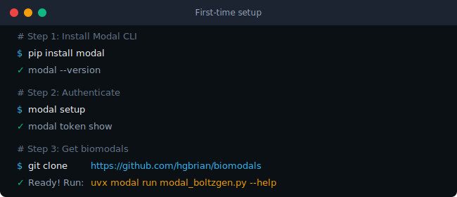
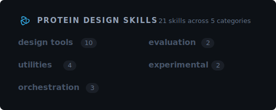
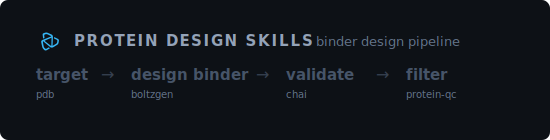

<p align="center">
  
</p>

<p align="center">
  <strong>21 Claude Code skills for computational protein design</strong>
</p>

<p align="center">
  <a href="docs/getting-started.md">Getting started</a> •
  <a href="docs/skills.md">Skills</a> •
  <a href="docs/standard-pipeline.md">Pipeline</a>
</p>

---

## Install

```
/plugin marketplace add adaptyvbio/protein-design-skills
/plugin install adaptyv@protein-design-skills
```

---

## Setup (first time)

<p align="center">
  
</p>

→ [Getting started](docs/getting-started.md)

---

## Skills

<p align="center">
  
</p>

→ [View all 21 skills](docs/skills.md)

---

## Pipeline

<p align="center">
  
</p>

→ [Standard pipeline](docs/standard-pipeline.md)

---

## Quick start

> "Design a binder for PDB 1ALU"

Claude will automatically use the right skills (BoltzGen → Chai → QC).

---

## Links

- [Getting started](docs/getting-started.md)
- [Skills](docs/skills.md)
- [Standard pipeline](docs/standard-pipeline.md)
- [Compute setup](docs/compute-setup.md)
- [Contributing](CONTRIBUTING.md)

---

## Contributing

### Creating a new skill

The easiest way to create a new skill is with Claude Code:

```
/skill skill-creator
```

This uses [Anthropic's skill-creator](https://github.com/anthropics/skills/tree/main/skills/skill-creator) to guide you through the process.

See [CONTRIBUTING.md](CONTRIBUTING.md) for detailed guidelines.

---

## License

MIT

## References

- [biomodals](https://github.com/hgbrian/biomodals) - Modal execution wrappers
- [Anthropic Skills](https://github.com/anthropics/skills) - Skills specification
